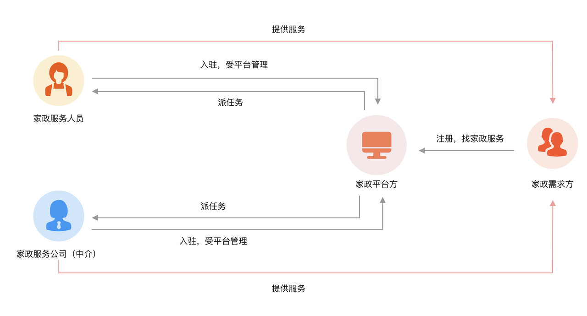
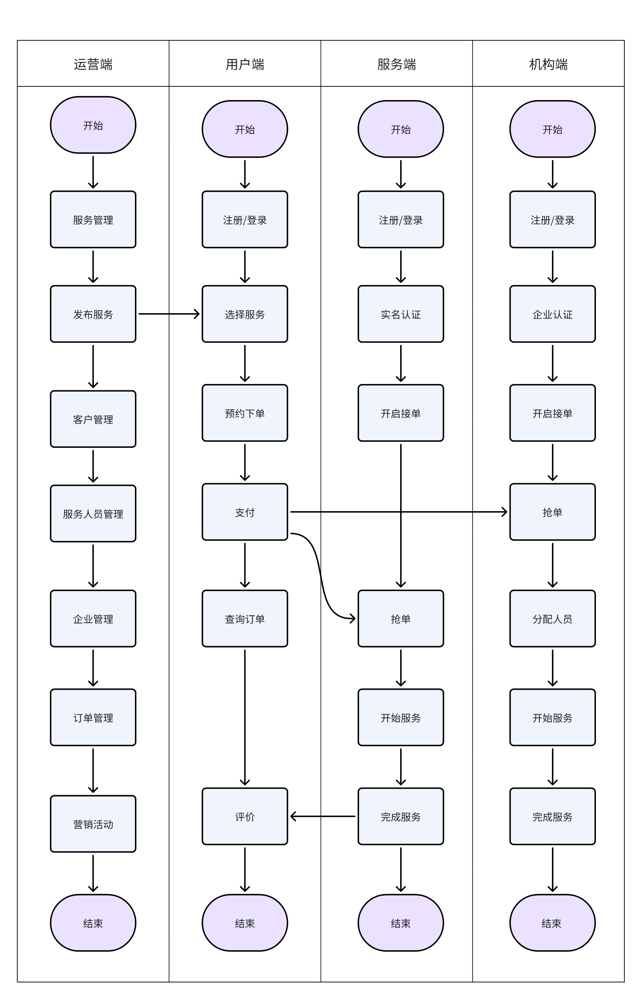
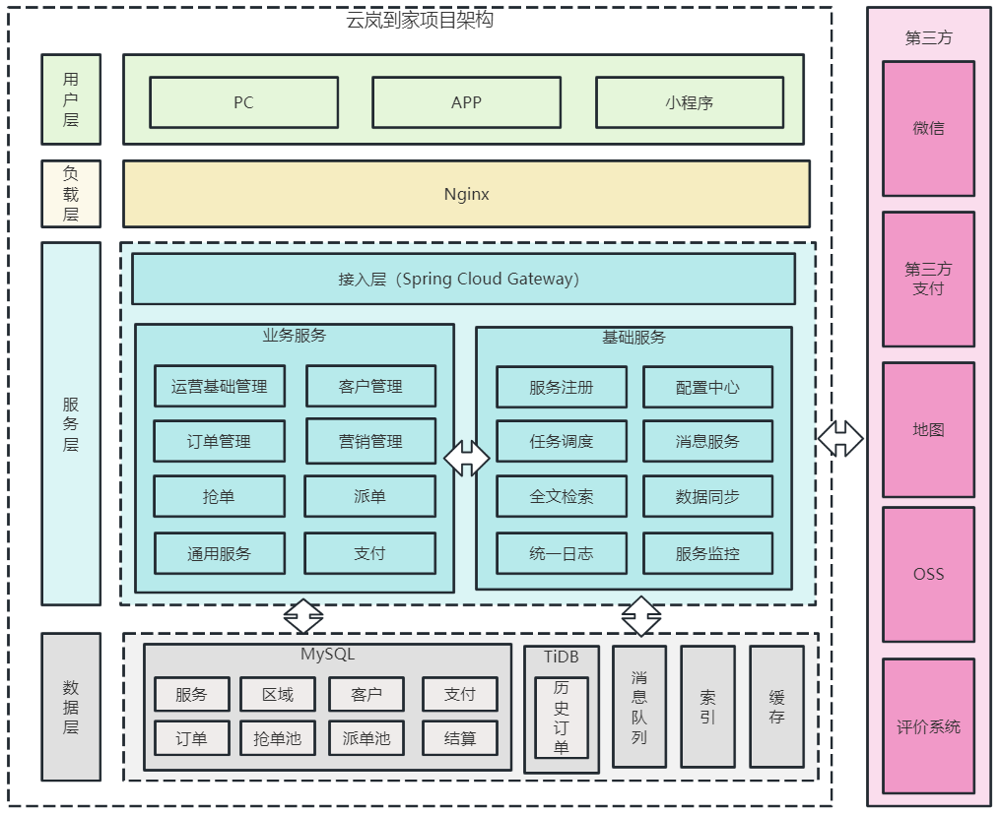
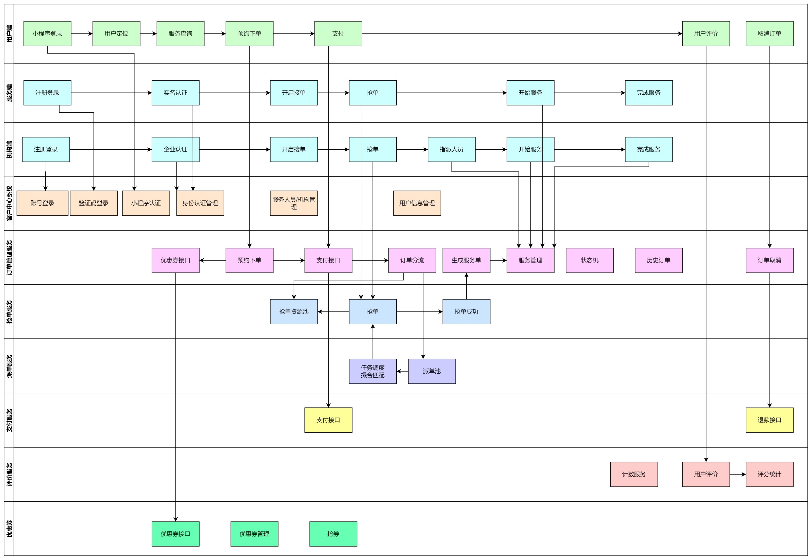

# jzo2o


jzo2o 是一个家政 O2O 平台，包含用户端、机构端和服务人员端，支持家政服务的在线交易流程。

## 一、项目介绍

### 1、项目背景
jzo2o 项目旨在打造一个家政 O2O 平台，实现服务人员、机构与用户的高效对接，提供从服务上架到订单结算的完整交易闭环。

### 2、运营模式
平台支持 B2B2C 与 C2B2C 两种运营模式：
- **B2B2C**：机构提供服务，平台负责撮合与抽成
- **C2B2C**：用户发布需求，机构或服务人员接单



### 3、项目业务流程
项目核心业务流程如下：



1. 运营端在运营区域上架家政服务
2. 用户端通过定位区域获取当前区域的服务项目，选择家政服务，下单、支付
3. 家政服务人员及机构通过平台抢单或派单
4. 服务完成后，订单结算，平台按比例抽成

### 4、项目演示
后台管理：https://jzo2o-operation.itheima.net/#/dashboard/base  
机构端：https://jzo2o-institution.itheima.net/#/dashboard/base  

## 二、项目架构

### 1、项目业务模块
| 模块            | 服务名称       | 功能说明                                  |
|------------------|----------------|-------------------------------------------|
| jzo2o-api        | 接口服务       | 微服务间远程调用接口                      |
| jzo2o-customer   | 客户管理       | 用户管理、服务人员管理、机构管理            |
| jzo2o-foundations| 基础服务       | 服务管理、区域管理                         |
| jzo2o-orders     | 订单管理       | 订单生命周期管理、抢单、派单、历史订单    |
| jzo2o-trade      | 交易服务       | 小程序支付、退款                           |
| jzo2o-market     | 营销活动       | 优惠券、活动管理                           |
| jzo2o-publics    | 通用服务       | 上传、定位等通用服务                       |
| jzo2o-framework  | 系统架构基础   | 提供通用架构封装                          |
| jzo2o-gateway    | 网关           | 请求过滤、负载均衡、路由转发                |

### 2、项目架构
项目基于 Spring Cloud Alibaba 构建，采用前后端分离架构。



主要技术栈：
- Spring Cloud Alibaba
- Redis 缓存
- Elasticsearch 搜索与地理定位
- ShardingSphere 分库分表
- Seata 分布式事务
- Canal + RabbitMQ 异构数据同步
- XXL-JOB 任务调度
- 状态机引擎 流程控制

### 3、学习收获
通过本项目，开发者可以掌握：
1. 项目需求分析与系统设计
2. 微服务开发与调优（Spring Cloud Alibaba）
3. Redis 缓存方案设计
4. Canal + MQ 数据同步
5. Elasticsearch 全文检索与地理搜索
6. ShardingSphere 分库分表
7. Seata 分布式事务控制
8. XXL-JOB 调度与线程池管理
9. 状态机流程设计
10. 秒杀、派单调度、服务管理等业务系统设计
11. 统计分析与看板系统开发

## 三、核心功能演示

### 启动顺序
1. 启动 jzo2o-gateway
2. 启动 jzo2o-customer
3. 启动 jzo2o-publics
4. 启动 jzo2o-foundations
5. 启动 jzo2o-orders-manager
6. 启动 jzo2o-orders-seize
7. 启动管理端（前端）
8. 启动服务端（前端）
9. 启动用户端（前端）
10. 启动 Canal 前需执行 `reset master` 并删除 `meta.dat`

### 核心业务流程
1. **服务管理**：运营端上架家政服务（如北京上架日常保洁、空调维修）
2. **用户下单**：用户通过小程序查询服务，选择后下单并支付
3. **抢单/派单**：服务人员或机构设置服务范围与技能后，通过抢单或系统派单获取订单
4. **订单管理**：订单生命周期管理（创建、取消、完成等）
5. **交易结算**：平台根据订单完成情况抽成



## 四、部署与开发环境

### 技术栈
- Spring Boot 2.x
- Spring Cloud Alibaba 2022.x
- Nacos 服务注册与配置中心
- Redis 缓存
- Elasticsearch 全文检索与地理搜索
- RabbitMQ 消息队列
- MySQL 分库分表
- Seata 分布式事务
- XXL-JOB 任务调度
- Knife4j 接口文档

### 模块依赖关系
```
jzo2o-customer
├── jzo2o-api
├── jzo2o-framework
│   ├── jzo2o-common
│   ├── jzo2o-mvc
│   ├── jzo2o-rabbitmq
│   ├── jzo2o-es
│   ├── jzo2o-mysql
│   └── jzo2o-redis
├── jzo2o-orders
│   ├── jzo2o-orders-manager
│   ├── jzo2o-orders-seize
│   └── jzo2o-orders-dispatch
└── jzo2o-trade
```

### 项目结构
```
jzo2o/
├── README.md
├── docs/
│   └── images/
├── jzo2o-api/
│   └── README.md
├── jzo2o-customer/
│   └── README.md
├── jzo2o-foundations/
│   └── README.md
├── jzo2o-gateway/
│   └── README.md
├── jzo2o-market/
│   └── README.md
├── jzo2o-orders/
│   ├── jzo2o-orders-dispatch/
│   ├── jzo2o-orders-history/
│   └── jzo2o-orders-seize/
├── jzo2o-publics/
│   └── README.md
└── jzo2o-trade/
    └── README.md
```

## 五、开发与部署

### 1. 开发环境
- JDK 11+
- Maven 3.6+
- Git
- IDE（IntelliJ IDEA / Eclipse）
- Docker（可选）

### 2. 构建项目
```bash
# 克隆项目
git clone https://gitee.com/itxinfei/jzo2o.git

# 进入项目目录
cd jzo2o

# 构建所有模块
mvn clean install
```

### 3. 部署项目
```bash
# 启动网关服务
cd jzo2o-gateway && mvn spring-boot:run

# 启动客户管理服务
cd ../jzo2o-customer && mvn spring-boot:run

# 启动基础服务（区域、服务项管理）
cd ../jzo2o-foundations && mvn spring-boot:run

# 启动订单管理服务
cd ../jzo2o-orders/jzo2o-orders-manager && mvn spring-boot:run

# 启动抢单服务
cd ../jzo2o-orders-seize && mvn spring-boot:run

# 启动交易服务
cd ../../jzo2o-trade && mvn spring-boot:run

# 启动营销服务
cd ../jzo2o-market && mvn spring-boot:run

# 启动公共通用服务
cd ../jzo2o-publics && mvn spring-boot:run
```

### 4. 前端部署
- 管理端：https://jzo2o-operation.itheima.net
- 机构端：https://jzo2o-institution.itheima.net
- 用户端：https://jzo2o-user.itheima.net

## 六、贡献指南

### 提交规范
1. 请确保提交前通过本地测试
2. 提交前请 pull 最新代码并解决冲突
3. 遵循 [Conventional Commits](https://www.conventionalcommits.org/) 规范
4. 提交前请确保代码风格统一（使用 IDEA 默认格式）
5. 请使用中文注释

### Issue 管理
- 请在 issue 中清晰描述 bug、需求或文档问题
- 开发者可认领 issue 进行修复
- 提交 PR 时请关联对应 issue

## 七、文档与社区

### 接口文档
项目使用 Knife4j 提供接口文档支持，文档地址：
- 客户管理服务：http://localhost:8080/doc.html
- 订单服务：http://localhost:8081/doc.html
- 基础服务：http://localhost:8082/doc.html
- 营销服务：http://localhost:8083/doc.html
- 交易服务：http://localhost:8084/doc.html

### 社区支持
- Gitee 仓库：https://gitee.com/itxinfei/jzo2o
- Issue 提交：https://gitee.com/itxinfei/jzo2o/issues
- Wiki：https://gitee.com/itxinfei/jzo2o/wikis
- 交流群：请加入 Gitee 社区讨论组

## 八、许可证
本项目基于 [MIT License](LICENSE)，可自由用于商业用途，但需保留原始版权声明。

## 九、项目维护者
项目由 [itxinfei](https://gitee.com/itxinfei) 维护，欢迎社区开发者参与贡献。

## 十、联系方式
- 邮箱：itxinfei@163.com
- 微信：请查看项目 Wiki
- Gitee：https://gitee.com/itxinfei/jzo2o

---
**项目核心交互流程图**

